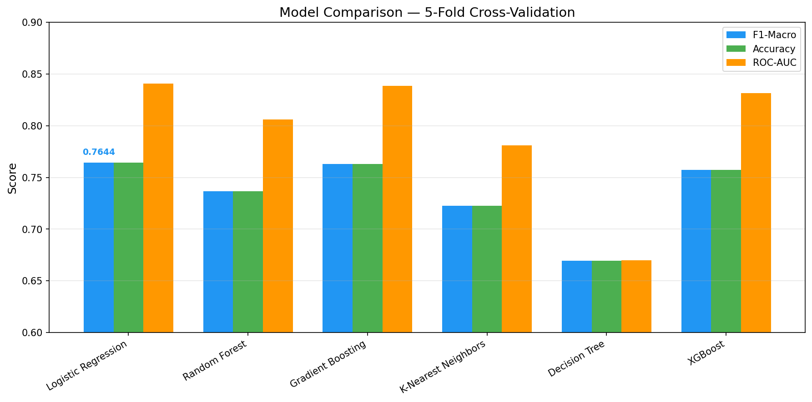
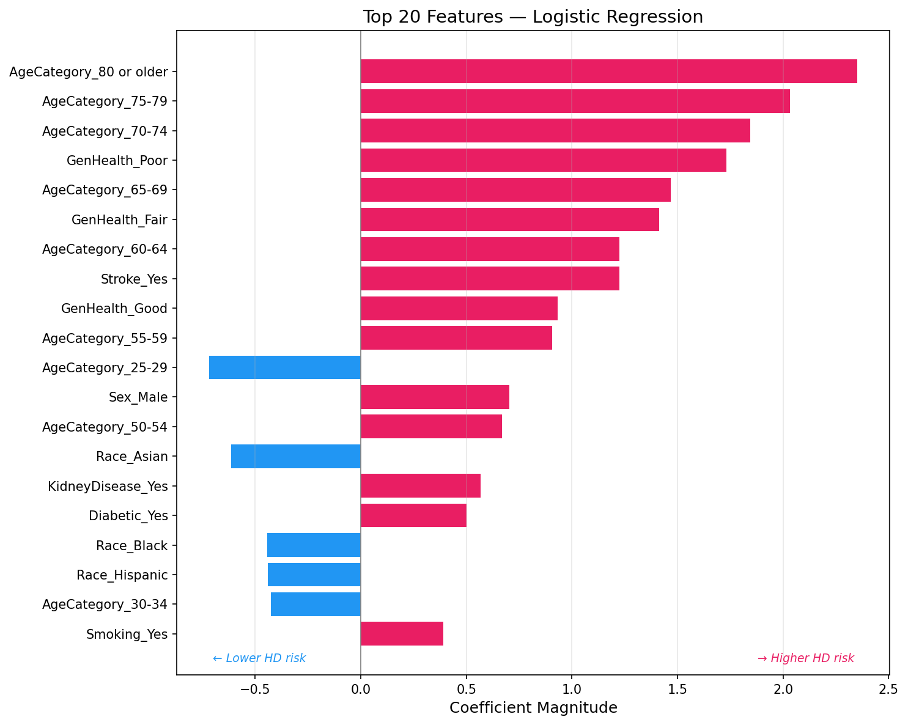
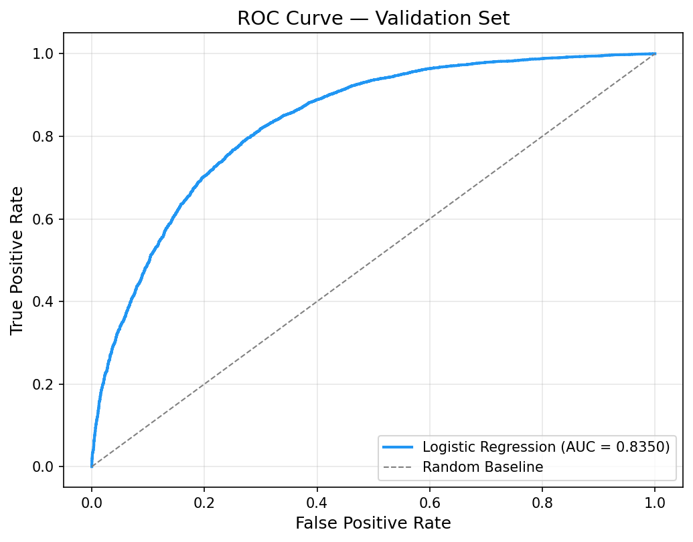
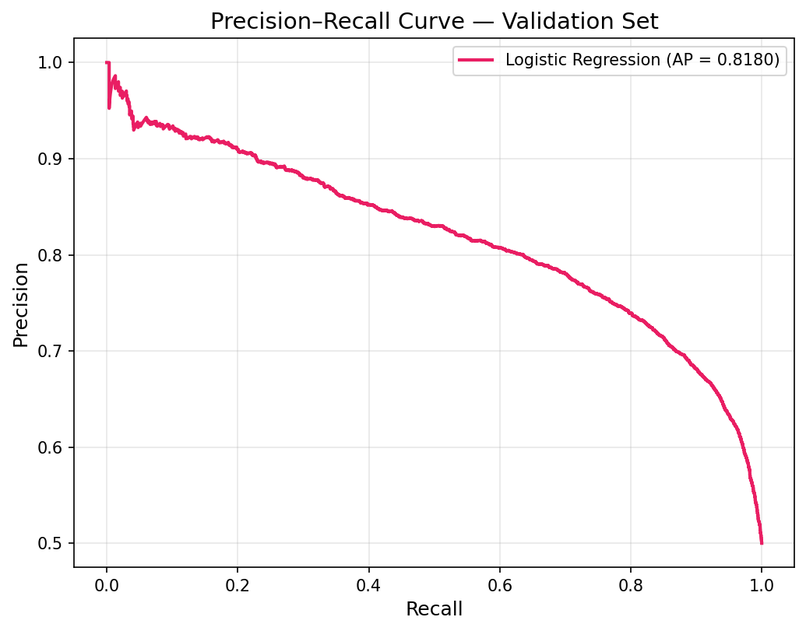

# Preventative Pulse — Predictive Analytics for Heart Disease

A machine learning pipeline that predicts heart disease from CDC behavioral survey data, achieving **83.5% ROC-AUC** and **75.7% F1-score** using logistic regression with SMOTE oversampling. Built on 319K+ patient records from the 2020 BRFSS survey, then applied to 445K unseen records from the 2022 survey.

---

## Key Results

### Model Performance

Six classifiers were evaluated using 5-fold stratified cross-validation with SMOTE applied inside each fold to prevent data leakage. Logistic regression narrowly outperformed gradient boosting and XGBoost on F1-Macro, the lead metric chosen for its sensitivity to the minority class.



**Final validation metrics (tuned logistic regression, 20% hold-out set):**

| Metric | Score |
|--------|-------|
| ROC-AUC | 0.835 |
| F1-Macro | 0.757 |
| Accuracy | 0.757 |
| Precision (Yes) | 0.75 |
| Recall (Yes) | 0.77 |

### Top Risk Factors

Logistic regression coefficients reveal the strongest predictors after scaling. The chart below shows the top 20 features by absolute coefficient magnitude — pink bars increase heart-disease risk, blue bars decrease it.



**Takeaways for clinicians:**
- Age dominates — the 80+ coefficient is 5× larger than any medical condition
- Stroke history and poor self-reported health are the next-strongest signals
- Kidney disease and diabetes show elevated risk but smaller model weight than expected, likely due to correlation with age
- Being in the 25–29 age bracket is the strongest *protective* factor

### ROC & Precision-Recall Curves

<p float="left">
  
  
</p>

The precision-recall curve (AP = 0.818) shows the model maintains >80% precision up to ~60% recall — meaning it can correctly flag 6 in 10 actual heart-disease cases while keeping false alarms manageable.

---

## Dataset

**Source:** [CDC BRFSS 2020](https://www.cdc.gov/brfss/annual_data/annual_2020.html) via [Kaggle](https://www.kaggle.com/datasets/kamilpytlak/personal-key-indicators-of-heart-disease)

| | Training (2020) | Test (2022) |
|--|----------------|-------------|
| Records | 319,795 | 445,132 |
| Features | 18 | 40 → aligned to 17 |
| Target | HeartDisease (Yes/No) | Predicted |
| Class balance | 91.4% No / 8.6% Yes | — |

**Features span three domains:**
- Medical history — diabetes, kidney disease, stroke, asthma, skin cancer
- Demographics — age, sex, race
- Lifestyle — smoking, alcohol, physical activity, sleep, BMI, self-rated health

Full per-variable EDA with distributions, outlier detection, and heart-disease rate breakdowns is documented in the notebook.

---

## Methodology

```
Raw Data (319K records, 18 columns)
  │
  ├─ Quality Audit ──── 0 nulls, 18K duplicates flagged, IQR outlier detection
  │
  ├─ EDA ──────────────  Per-variable distributions, target-rate analysis,
  │                      correlation heatmap, before/after rebalancing metrics
  │
  ├─ Preprocessing ───── Median/mode imputation → one-hot encoding →
  │                      StandardScaler (fit on train only) → feature alignment
  │
  ├─ Class Balancing ─── Random undersampling to 50/50 for training;
  │                      SMOTE inside CV folds for evaluation
  │
  ├─ Model Selection ─── 6 classifiers × 5-fold CV × 3 metrics
  │                      (F1-Macro, Accuracy, ROC-AUC)
  │
  ├─ Tuning ──────────── RandomizedSearchCV on best model
  │                      (C=0.1, penalty=L2, solver=liblinear)
  │
  └─ Prediction ──────── 445K test records → 31,089 predicted positive (7.0%)
```

---

## Repo Structure

```
Preventative-Pulse/
├── README.md
├── Preventative_Pulse.ipynb     # Full pipeline: EDA → modeling → results
├── requirements.txt
├── .gitignore
├── data/
│   ├── heart_2020_cleaned.csv   # Training data (2020 BRFSS, 320K rows)
│   └── heart_2022_with_nans.csv # Test data — download separately (see below)
└── figures/                     # Auto-generated by notebook
```

## How to Run

```bash
git clone https://github.com/yourusername/Preventative-Pulse.git
cd Preventative-Pulse
pip install -r requirements.txt
```

The 2022 test dataset (139 MB) is too large for GitHub. Download it from [Kaggle](https://www.kaggle.com/datasets/kamilpytlak/personal-key-indicators-of-heart-disease) and place the file in `data/heart_2022_with_nans.csv`. Sections 1–8 of the notebook run without it; only Section 9 (test-set predictions) requires it.

```bash
jupyter notebook Preventative_Pulse.ipynb
```

All figures are saved to `figures/` on execution.

---

## Tech Stack

Python · pandas · NumPy · scikit-learn · imbalanced-learn (SMOTE) · XGBoost · Matplotlib · Seaborn

---

## License

Dataset published by [Kamil Pytlak](https://www.kaggle.com/datasets/kamilpytlak/personal-key-indicators-of-heart-disease) under CC BY-SA 4.0. Code in this repository is MIT licensed.
